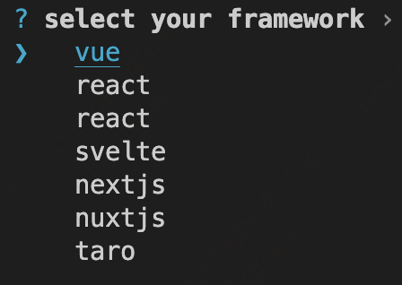

# fe-weki

## Create your web app with fe-weki


### how to use

```bash
fe-weki appName
```
select your framework


wait ...

### add your framework

```bash
fe-weki add vue --init="npm init vue@latest"
```